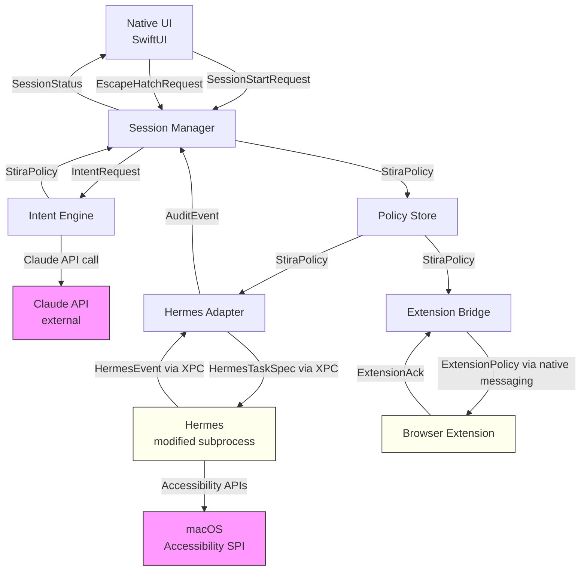

# Stira MVP — Engineering Architecture Plan

> **For agentic workers:** REQUIRED SUB-SKILL: Use superpowers:subagent-driven-development (recommended) or superpowers:executing-plans to implement this plan task-by-task. Steps use checkbox (`- [ ]`) syntax for tracking.

**Goal:** Define the complete pre-code engineering architecture for the Stira MVP — every component, interface contract, ownership assignment, build sequence, and risk — so three engineers can build independently without stepping on each other.

**Architecture:** Stira is a three-component local-first system: an Intent Engine that converts natural language into a structured Policy object, a modified Hermes Agent that consumes that policy to enforce macOS app behaviour, and a Browser Extension that enforces URL rules within the browser. The Policy object is the central data structure; every other interface contract derives from it.

**Tech Stack:** Swift/SwiftUI (native macOS UI), Python (Hermes Agent — Nous Research fork), TypeScript (browser extension), Claude API (MVP intent parsing), JSON (policy format), XPC (IPC between UI and Hermes subprocess).

---

## 1. System Architecture
  
### Component Definitions

---

#### 1.1 Intent Engine

**Owns:**
- Receiving raw natural language intent from the UI
- Calling the Claude API with a structured prompt
- Parsing the API response into a validated `StiraPolicy` object
- Attaching confidence score and model attribution to the policy

**Does NOT own:**
- Enforcement decisions
- Session lifecycle management
- Storing the policy beyond handing it off
- Retry logic for the API call (Session Manager owns retry policy)

**Interface contract:**

| Direction | Type | Shape |
|-----------|------|-------|
| IN | `IntentRequest` | `{ raw_text: string, user_context?: UserContext }` |
| OUT | `StiraPolicy` | Full policy object (see Section 2) |
| OUT (error) | `IntentError` | `{ code: "api_failure" | "parse_failure" | "confidence_too_low", message: string, raw_response?: string }` |

**Dependencies:** Claude API (external), Policy Schema (internal type definition)

---

#### 1.2 Policy Store

**Owns:**
- Holding the active `StiraPolicy` for the duration of a session
- Providing read access to any component that needs the policy
- Invalidating / replacing the policy when a new session starts or an escape hatch exception is applied
- Writing the policy to a local file for crash recovery

**Does NOT own:**
- Generating the policy
- Enforcing the policy
- Persisting policy history (audit log is the Session Manager's job)

**Interface contract:**

| Direction | Type | Shape |
|-----------|------|-------|
| IN | `StiraPolicy` | Written by the Session Manager after intent parsing |
| OUT | `StiraPolicy` | Read by Hermes Adapter, Extension Bridge, UI |
| IN | `PolicyPatch` | Escape hatch exception applied mid-session: `{ scoped_exception: ScopedException, reason: string }` |

**Dependencies:** Policy Schema (type definition only)

---

#### 1.3 Session Manager

**Owns:**
- Orchestrating the full session lifecycle: start → enforce → escape hatch → end
- Receiving the `IntentRequest` from the UI and dispatching it to the Intent Engine
- Writing the returned `StiraPolicy` to the Policy Store
- Managing the escape hatch flow: timing, reason collection, scoped exception generation
- Aggregating audit events from Hermes Adapter and writing the session audit log
- Signalling session end to all enforcement components

**Does NOT own:**
- Parsing intent (Intent Engine)
- Executing enforcement actions (Hermes Adapter / Extension Bridge)
- Displaying UI (Native UI)

**Interface contract:**

| Direction | Type | Shape |
|-----------|------|-------|
| IN | `SessionStartRequest` | `{ raw_intent: string }` from UI |
| IN | `EscapeHatchRequest` | `{ reason: string, target: AppId | UrlPattern, duration_minutes: number }` from UI |
| IN | `AuditEvent` | Enforcement events streamed from Hermes Adapter |
| OUT | `SessionStatus` | `{ state: "idle" | "active" | "escape_hatch_pending" | "ended", policy: StiraPolicy, elapsed_seconds: number }` to UI |
| OUT | `SessionAuditLog` | Written to local disk at session end |

**Dependencies:** Intent Engine, Policy Store, Hermes Adapter, Extension Bridge, Native UI (via event emission)

---

#### 1.4 Hermes Adapter

**Owns:**
- The stable interface boundary between Stira and the Hermes subprocess
- Translating `StiraPolicy` into the Hermes task format
- Starting, monitoring, and stopping the Hermes subprocess
- Receiving `AuditEvent` objects from Hermes and forwarding them to Session Manager
- Version-checking the Hermes binary at startup

**Does NOT own:**
- Hermes internals
- Enforcement mechanics (those live inside Hermes)
- Policy generation

**Interface contract (Stira → Hermes):**

| Direction | Type | Shape |
|-----------|------|-------|
| IN | `StiraPolicy` | From Policy Store, translated to `HermesTaskSpec` |
| OUT | `HermesTaskSpec` | `{ blocked_apps: BundleId[], enforcement_mode: "suppress" | "kill_focus", session_duration_seconds: number }` |
| IN (from Hermes) | `HermesEvent` | `{ type: "app_blocked" | "focus_killed" | "app_opened", bundle_id: string, timestamp: ISO8601 }` |
| OUT (to Session Manager) | `AuditEvent` | Normalised version of `HermesEvent` |

**IPC mechanism:** XPC service (macOS native). Hermes runs as a separate process. The Adapter owns the XPC connection lifecycle.

**Dependencies:** Policy Store, Session Manager (for event forwarding), Hermes subprocess

---

#### 1.5 Hermes (Modified)

**Owns:**
- macOS enforcement: blocking named apps from foregrounding, killing focus if a blocked app comes to front, monitoring what apps the user opens
- Writing raw enforcement events to its local audit stream
- Persisting its own memory/skill documents to a local directory

**Does NOT own:**
- Policy interpretation (Hermes Adapter translates before passing in)
- UI of any kind
- Network calls
- Session management

**Interface contract (as seen from Stira):**

| Direction | Type | Shape |
|-----------|------|-------|
| IN | `HermesTaskSpec` | Received via XPC from Hermes Adapter |
| OUT | `HermesEvent` | Streamed via XPC to Hermes Adapter |

**Dependencies:** macOS Accessibility APIs, `HermesTaskSpec` schema (owned by Hermes Adapter)

See Section 5 for the complete Hermes modification plan.

---

#### 1.6 Extension Bridge

**Owns:**
- Transmitting the URL-relevant portions of `StiraPolicy` to the browser extension
- Receiving status confirmations from the extension
- Using native messaging to communicate with the extension

**Does NOT own:**
- URL matching or enforcement (the extension does this)
- Policy generation

**Interface contract:**

| Direction | Type | Shape |
|-----------|------|-------|
| IN | `StiraPolicy` | Reads from Policy Store |
| OUT | `ExtensionPolicy` | `{ blocked_url_patterns: UrlRule[], allowed_url_exceptions: UrlException[], session_token: string }` sent via native messaging |
| IN | `ExtensionAck` | `{ session_token: string, rules_applied: number }` confirmation from extension |

**Dependencies:** Policy Store, Browser Extension (via native messaging host)

---

#### 1.7 Browser Extension

**Owns:**
- Receiving `ExtensionPolicy` from the Extension Bridge
- Applying `declarativeNetRequest` rules to block URLs
- Reporting back `ExtensionAck` confirming rules are applied

**Does NOT own:**
- Policy generation
- App-level enforcement
- Escape hatch UX

**Interface contract:**

| Direction | Type | Shape |
|-----------|------|-------|
| IN | `ExtensionPolicy` | Via native messaging from Extension Bridge |
| OUT | `ExtensionAck` | Via native messaging back to Extension Bridge |

**Dependencies:** Extension Bridge (for policy), Chrome/Safari WebExtensions API

---

#### 1.8 Native UI

**Owns:**
- Intent input field and session start button
- Session status display (active, elapsed time, current mode)
- Escape hatch UX: trigger, delay countdown, reason input, confirmation
- First-run onboarding flow (Accessibility permission request)

**Does NOT own:**
- Policy generation or parsing
- Enforcement
- Session lifecycle (Session Manager owns this — UI calls into it)

**Interface contract:**

| Direction | Type | Shape |
|-----------|------|-------|
| IN | `SessionStatus` | From Session Manager, drives all UI state |
| OUT | `SessionStartRequest` | User submits intent text |
| OUT | `EscapeHatchRequest` | User triggers override |

**Dependencies:** Session Manager (via event binding)

---

### Dependency Graph (Mermaid)



---

## 2. Policy Schema

The `StiraPolicy` object is the central data structure of the entire product. It is produced once at session start by the Intent Engine and consumed by every enforcement component. The schema must be versioned from day one to allow migration without breaking running sessions.

### 2.1 Full Schema Definition

```
StiraPolicy {
  // --- Envelope ---
  schema_version:       string          // "1.0" — semver, bump minor for additive changes, major for breaking
  session_id:           string          // UUID v4, generated by Session Manager
  created_at:           string          // ISO 8601 UTC

  // --- Intent Provenance ---
  intent: {
    raw:                string          // Verbatim user input, never modified
    normalised:         string          // Lowercased, trimmed — used for logging/learning
    confidence:         number          // 0.0–1.0, from Intent Engine
    model:              string          // e.g. "claude-opus-4-7" — which model produced this
    api_fallback_used:  boolean         // true if local models were bypassed (MVP: always true)
  }

  // --- Session Bounds ---
  session: {
    duration_minutes:   number          // Requested session length; 0 = indefinite
    hard_stop:          boolean         // true = session ends at duration_minutes, no extension
    started_at:         string | null   // ISO 8601, null until Session Manager starts enforcement
  }

  // --- App Enforcement ---
  apps: {
    mode:               "block_listed" | "allow_listed"
    // block_listed: everything is allowed except `blocked`
    // allow_listed: everything is blocked except `allowed`
    blocked:            AppRule[]       // populated when mode = "block_listed"
    allowed:            AppRule[]       // populated when mode = "allow_listed"
  }

  // --- URL Enforcement ---
  urls: {
    rules:              UrlRule[]
  }

  // --- Notification Posture ---
  notifications: {
    mode:               "suppress_all" | "allow_all" | "allow_calendar" | "allow_calls_only"
  }

  // --- Escape Hatch ---
  escape_hatch: {
    mode:               "soft" | "standard" | "strict" | "nuclear"
    // MVP: only "standard" is implemented
    delay_seconds:      number          // MVP: 30
    require_reason:     boolean         // MVP: true
    exception_scope:    "scoped" | "global"
    // MVP: always "scoped" — global disable not available
    active_exceptions:  ScopedException[]
    // Populated at runtime as the user exercises escape hatches
  }

  // --- Audit Config ---
  audit: {
    log_level:          "minimal" | "normal" | "verbose"
    log_path:           string          // Absolute path to session audit log file
  }
}

AppRule {
  bundle_id:            string          // e.g. "com.twitter.twitter"
  display_name:         string          // Human-readable, for UI only — not used in enforcement
}

UrlRule {
  pattern:              string          // Glob or domain e.g. "reddit.com", "*.twitter.com"
  action:               "block" | "allow"
  exceptions:           UrlException[]
  reason:               string | null   // Why this rule exists, for audit/learning
}

UrlException {
  pattern:              string          // Sub-path that overrides the parent rule
  reason:               string          // e.g. "youtube.com/watch — for lecture videos"
}

ScopedException {
  exception_id:         string          // UUID
  target_type:          "app" | "url"
  target:               string          // bundle_id or url pattern
  granted_at:           string          // ISO 8601
  expires_at:           string          // ISO 8601 — always set for "standard" mode
  reason:               string          // User-typed reason
}

UserContext {
  // Optional additional context the UI may pass to the Intent Engine
  // Not used in MVP — schema slot reserved
  previous_intents:     string[]        // Last N raw intent strings (for learning)
}
```

---

### 2.2 Example Policy Objects

#### Example A — "I need to finish my quarterly report"

```json
{
  "schema_version": "1.0",
  "session_id": "a1b2c3d4-...",
  "created_at": "2026-05-25T14:30:00Z",
  "intent": {
    "raw": "I need to finish my quarterly report",
    "normalised": "i need to finish my quarterly report",
    "confidence": 0.96,
    "model": "claude-opus-4-7",
    "api_fallback_used": true
  },
  "session": {
    "duration_minutes": 90,
    "hard_stop": false,
    "started_at": null
  },
  "apps": {
    "mode": "block_listed",
    "blocked": [
      { "bundle_id": "com.twitter.twitter", "display_name": "Twitter" },
      { "bundle_id": "com.apple.iMessage", "display_name": "Messages" },
      { "bundle_id": "com.tinyspeck.slackmacgap", "display_name": "Slack" },
      { "bundle_id": "com.hnc.Discord", "display_name": "Discord" },
      { "bundle_id": "com.apple.mail", "display_name": "Mail" }
    ],
    "allowed": []
  },
  "urls": {
    "rules": [
      { "pattern": "twitter.com", "action": "block", "exceptions": [], "reason": "social media" },
      { "pattern": "reddit.com", "action": "block", "exceptions": [], "reason": "social media" },
      { "pattern": "news.ycombinator.com", "action": "block", "exceptions": [], "reason": "social media" },
      { "pattern": "instagram.com", "action": "block", "exceptions": [], "reason": "social media" },
      { "pattern": "youtube.com", "action": "block", "exceptions": [], "reason": "video distraction" }
    ]
  },
  "notifications": { "mode": "suppress_all" },
  "escape_hatch": {
    "mode": "standard",
    "delay_seconds": 30,
    "require_reason": true,
    "exception_scope": "scoped",
    "active_exceptions": []
  },
  "audit": {
    "log_level": "normal",
    "log_path": "/Users/ronith/Library/Application Support/Stira/sessions/a1b2c3d4/audit.jsonl"
  }
}
```

---

#### Example B — "Watching lecture videos on distributed systems"

```json
{
  "schema_version": "1.0",
  "session_id": "b2c3d4e5-...",
  "created_at": "2026-05-25T19:00:00Z",
  "intent": {
    "raw": "Watching lecture videos on distributed systems",
    "normalised": "watching lecture videos on distributed systems",
    "confidence": 0.89,
    "model": "claude-opus-4-7",
    "api_fallback_used": true
  },
  "session": {
    "duration_minutes": 120,
    "hard_stop": false,
    "started_at": null
  },
  "apps": {
    "mode": "block_listed",
    "blocked": [
      { "bundle_id": "com.twitter.twitter", "display_name": "Twitter" },
      { "bundle_id": "com.apple.iMessage", "display_name": "Messages" },
      { "bundle_id": "com.tinyspeck.slackmacgap", "display_name": "Slack" },
      { "bundle_id": "com.hnc.Discord", "display_name": "Discord" }
    ],
    "allowed": []
  },
  "urls": {
    "rules": [
      { "pattern": "twitter.com", "action": "block", "exceptions": [], "reason": "social media" },
      { "pattern": "reddit.com", "action": "block", "exceptions": [], "reason": "social media" },
      { "pattern": "instagram.com", "action": "block", "exceptions": [], "reason": "social media" },
      {
        "pattern": "youtube.com",
        "action": "block",
        "exceptions": [
          {
            "pattern": "youtube.com/watch",
            "reason": "lecture videos are on youtube.com/watch — permitted"
          },
          {
            "pattern": "youtube.com/playlist",
            "reason": "lecture playlists permitted"
          }
        ],
        "reason": "YouTube permitted only for watch/playlist paths — not home feed"
      }
    ]
  },
  "notifications": { "mode": "allow_calendar" },
  "escape_hatch": {
    "mode": "standard",
    "delay_seconds": 30,
    "require_reason": true,
    "exception_scope": "scoped",
    "active_exceptions": []
  },
  "audit": {
    "log_level": "normal",
    "log_path": "/Users/ronith/Library/Application Support/Stira/sessions/b2c3d4e5/audit.jsonl"
  }
}
```

---

#### Example C — "Deep work: coding on my side project, no interruptions"

```json
{
  "schema_version": "1.0",
  "session_id": "c3d4e5f6-...",
  "created_at": "2026-05-25T09:00:00Z",
  "intent": {
    "raw": "Deep work: coding on my side project, no interruptions",
    "normalised": "deep work: coding on my side project, no interruptions",
    "confidence": 0.98,
    "model": "claude-opus-4-7",
    "api_fallback_used": true
  },
  "session": {
    "duration_minutes": 180,
    "hard_stop": false,
    "started_at": null
  },
  "apps": {
    "mode": "allow_listed",
    "blocked": [],
    "allowed": [
      { "bundle_id": "com.microsoft.VSCode", "display_name": "VS Code" },
      { "bundle_id": "com.apple.Terminal", "display_name": "Terminal" },
      { "bundle_id": "com.googlecode.iterm2", "display_name": "iTerm2" },
      { "bundle_id": "com.apple.safari", "display_name": "Safari" },
      { "bundle_id": "com.google.Chrome", "display_name": "Chrome" },
      { "bundle_id": "org.postgresql.psql", "display_name": "PostgreSQL" },
      { "bundle_id": "com.github.GitHubDesktop", "display_name": "GitHub Desktop" }
    ]
  },
  "urls": {
    "rules": [
      { "pattern": "twitter.com", "action": "block", "exceptions": [], "reason": "social media" },
      { "pattern": "reddit.com", "action": "block", "exceptions": [], "reason": "social media" },
      { "pattern": "instagram.com", "action": "block", "exceptions": [], "reason": "social media" },
      { "pattern": "youtube.com", "action": "block", "exceptions": [], "reason": "video distraction" },
      { "pattern": "news.ycombinator.com", "action": "block", "exceptions": [], "reason": "distraction" }
    ]
  },
  "notifications": { "mode": "suppress_all" },
  "escape_hatch": {
    "mode": "standard",
    "delay_seconds": 60,
    "require_reason": true,
    "exception_scope": "scoped",
    "active_exceptions": []
  },
  "audit": {
    "log_level": "verbose",
    "log_path": "/Users/ronith/Library/Application Support/Stira/sessions/c3d4e5f6/audit.jsonl"
  }
}
```

---

## 3. Component Ownership

### Team Assignment

| Engineer | Role | Owns |
|----------|------|------|
| **Engineer A** | Backend / AI | Intent Engine, Policy Schema (type definitions), Claude API prompt engineering, audit log format |
| **Engineer B** | Systems / macOS | Hermes subprocess modification, Hermes Adapter, XPC IPC layer, macOS permissions flow |
| **Engineer C** | Frontend / Browser | Native UI (SwiftUI), Session Manager, Policy Store, Extension Bridge, Browser Extension |

This split is chosen so each engineer has a complete vertical slice that can be developed and tested independently. Engineer C owns the Session Manager because the session lifecycle is tightly coupled to UI state — a backend engineer writing session logic for a UI they don't own creates coordination overhead.

---

### Handoff Contracts

#### Handoff 1: Engineer A → Everyone (Policy Schema)

**What is handed off:** A versioned JSON schema document (`docs/schema/stira-policy.schema.json`) and corresponding type definitions in Swift (`StiraPolicy.swift`) and Python (`stira_policy.py`).

**Format:** JSON Schema draft-07 with inline documentation, plus generated Swift struct and Python dataclass. Both typed representations are generated from the JSON schema — the JSON schema is the source of truth.

**When:** Before any other engineer writes a single line of code. This is the literal first deliverable. No implementation work begins until Engineer A's schema is ratified by all three.

**Ratification:** A 30-minute sync where all three engineers independently attempt to express three real user intents as policy objects. If any intent cannot be cleanly expressed, the schema is amended before the sync ends.

---

#### Handoff 2: Engineer A → Engineer C (Intent Engine → Session Manager)

**What is handed off:** A working `IntentEngine` module that accepts `IntentRequest` and returns `StiraPolicy | IntentError`.

**Format:** Python module with a single public function `parse_intent(request: IntentRequest) -> StiraPolicy`. Tested against at least 20 varied intent strings. Test suite is part of the handoff.

**When:** Engineer C cannot implement the Session Manager's session-start flow until this function exists. However, Engineer C builds against a stub that returns a hardcoded `StiraPolicy` until the real implementation is ready. The stub is the contract; the real implementation replaces it.

---

#### Handoff 3: Engineer B → Engineer C (Hermes Adapter → Session Manager)

**What is handed off:** A working `HermesAdapter` class with two methods: `start_session(task_spec: HermesTaskSpec)` and `stop_session()`, plus an event callback `on_event(handler: (AuditEvent) -> void)`.

**Format:** Swift class conforming to a `HermesAdapterProtocol` that Engineer C defines. Engineer C defines the protocol; Engineer B implements it. This is the interface boundary — Engineer C writes the protocol first, then Engineer B builds to it.

**When:** Engineer C defines the `HermesAdapterProtocol` in Week 1. Engineer B builds to it in Week 2. Engineer C integrates the real implementation in Week 3.

---

#### Handoff 4: Engineer C → Browser Extension (Extension Bridge → Extension)

**What is handed off:** A native messaging host (`com.stira.extensionbridge`) that accepts `ExtensionPolicy` messages and emits `ExtensionAck` responses.

**Format:** Standard WebExtensions native messaging protocol. Message schemas are defined in `docs/schema/extension-messages.json` (Engineer C writes this).

**When:** Engineer C builds the Extension Bridge and Extension in the same sprint — they are tightly coupled enough that splitting them between engineers would create more coordination overhead than value.

---

## 4. Build Sequence

### Critical Path

The critical path is:

```
Policy Schema → Intent Engine → Hermes Adapter → Session Manager → Integration → 10-second test
```

Nothing on this path can be parallelised with the step before it. Everything off this path can be started earlier.

---

### Dependency-Ordered Sequence

#### Phase 0 — Schema (Blocks everything)

| Item | Owner | MVP? | Parallelisable with |
|------|-------|------|---------------------|
| Policy schema JSON + type definitions | A | YES | Nothing |
| Extension message schema | C | YES | Nothing |

**Duration:** 2–3 days. No implementation work begins until Phase 0 is complete and ratified.

---

#### Phase 1 — Stubs and Skeletons (Can be parallelised after Phase 0)

| Item | Owner | MVP? | Parallelisable with |
|------|-------|------|---------------------|
| `HermesAdapterProtocol` (Swift protocol definition) | C | YES | Phase 1 items |
| Intent Engine stub (returns hardcoded policy) | A | YES | Phase 1 items |
| Hermes audit of existing codebase (what to remove) | B | YES | Phase 1 items |
| SwiftUI app shell (window, no logic) | C | YES | Phase 1 items |
| Browser extension manifest + empty service worker | C | YES | Phase 1 items |

**Duration:** 3–4 days. All three engineers work in parallel.

---

#### Phase 2 — Core Implementations (Partially parallelisable)

| Item | Owner | MVP? | Depends on | Parallelisable with |
|------|-------|------|------------|---------------------|
| Hermes modification (strip to 3 actions, XPC layer) | B | YES | Phase 1 (Hermes audit) | Intent Engine impl, Extension impl |
| Intent Engine real implementation (Claude API call) | A | YES | Phase 1 (stub) | Hermes modification, Extension impl |
| URL enforcement in browser extension | C | YES | Phase 0 (ext schema) | Hermes modification |
| Policy Store (in-memory + file persistence) | C | YES | Phase 0 (schema) | All Phase 2 items |
| Escape hatch — Standard mode UX (UI only, no enforcement yet) | C | YES | SwiftUI shell | All Phase 2 items |

**Duration:** 1–2 weeks. Critical path is Hermes modification (longest task).

---

#### Phase 3 — Integration (Sequential — cannot parallelise)

| Item | Owner | MVP? | Depends on |
|------|-------|------|------------|
| Session Manager implementation | C | YES | Intent Engine real, HermesAdapterProtocol impl, Policy Store |
| Hermes Adapter real implementation | B | YES | Hermes modification |
| Extension Bridge (native messaging host) | C | YES | Extension URL enforcement |
| Wire Session Manager → Hermes Adapter | B+C | YES | Session Manager, Hermes Adapter |
| Wire Session Manager → Extension Bridge | C | YES | Session Manager, Extension Bridge |

**Duration:** 1 week. High coordination risk — daily syncs required.

---

#### Phase 4 — Polish and First Run (Parallelisable)

| Item | Owner | MVP? | Depends on |
|------|-------|------|------------|
| Native UI full implementation (status display, escape hatch countdown) | C | YES | Session Manager |
| macOS Accessibility permission onboarding flow | C | YES | Native UI |
| Escape hatch reason entry + scoped exception enforcement | B+C | YES | Session Manager + Hermes Adapter |
| Intent Engine prompt engineering (quality pass) | A | YES | Intent Engine real |
| End-to-end 10-second test validation | All | YES | Phase 3 complete |

**Duration:** 3–5 days.

---

#### Phase 5 — Post-MVP (After launch)

| Item | Owner | MVP? |
|------|-------|------|
| FastText local classifier | A | NO |
| BGE-small-en semantic embeddings | A | NO |
| DOM manipulation layer (browser ext) | C | NO |
| Vision fallback layer (browser ext) | C | NO |
| Soft / Strict / Nuclear escape hatch modes | C | NO |
| Hermes session learning (load-bearing) | B | NO |
| Settings screen | C | NO |
| Analytics and session reporting | A | NO |
| Paddle pricing integration | C | NO |

---

## 5. Hermes Modification Plan

### What Gets Removed

| Component | Reason for removal |
|-----------|-------------------|
| Chat interface / messaging gateway | Stira never surfaces a chat UI; Hermes must be invisible |
| CLI prompt / REPL | Input comes programmatically from Stira, not from a human |
| Web server / API server (if present) | Stira uses XPC, not HTTP |
| Any startup UI or splash screen | Hermes runs as a background subprocess |
| Onboarding flow | Stira owns onboarding entirely |
| General-purpose skill library (anything not in the 3 MVP skills) | These are a maintenance surface; ship only what's needed |

---

### What Gets Hardwired

| Component | Behaviour |
|-----------|-----------|
| Three enforcement skills | App suppression, focus kill, app open monitoring — baked in at build time, not loaded from disk at runtime |
| Memory storage path | Hardwired to `~/Library/Application Support/Stira/hermes-memory/` — not configurable |
| XPC service identifier | `com.stira.hermes` — hardwired in `Info.plist` |
| Task input pathway | `PolicyReceiver` (see below) is the only entry point; all other input mechanisms are removed |

---

### What Gets Added

| Component | Description |
|-----------|-------------|
| `PolicyReceiver` | XPC-exposed endpoint. Accepts `HermesTaskSpec` from Hermes Adapter, validates schema version, populates internal task queue. This is the only way Stira activates Hermes. |
| `EventEmitter` | XPC-exposed stream. Emits `HermesEvent` objects to the Hermes Adapter as enforcement events occur. Fires on: app blocked, focus killed, app opened during session. |
| `SessionController` | Internal component that translates `HermesTaskSpec` into the three enforcement skills and manages their lifecycle for the session duration. |
| `StopSignalHandler` | Listens for `stop_session` command from Hermes Adapter. Gracefully shuts down enforcement, flushes any buffered events, exits cleanly. |

---

### The Stable Interface Contract (Stira ↔ Hermes)

This boundary is treated as a public API. Hermes internals may change; this contract must not change without a migration plan.

**Hermes Adapter → Hermes (task ingress):**

```
HermesTaskSpec {
  spec_version:           string          // "1.0" — Hermes validates this against its own supported versions
  session_id:             string          // UUID — echoed back in every HermesEvent
  blocked_bundle_ids:     string[]        // List of macOS bundle IDs to suppress
  enforcement_mode:       "suppress" | "kill_focus"
  // suppress: prevent the app from coming to foreground
  // kill_focus: allow it to front briefly, then immediately defocus it
  session_duration_seconds: number        // 0 = indefinite
  audit_level:            "minimal" | "normal" | "verbose"
}
```

**Hermes → Hermes Adapter (event egress):**

```
HermesEvent {
  event_version:          string          // "1.0"
  session_id:             string          // Echoed from HermesTaskSpec
  event_id:               string          // UUID per event
  timestamp:              string          // ISO 8601 UTC
  type:                   "app_blocked" | "focus_killed" | "app_opened" | "session_started" | "session_ended" | "error"
  bundle_id:              string | null   // null for session lifecycle events
  error_message:          string | null   // null unless type = "error"
}
```

**Version negotiation:** Hermes Adapter reads Hermes's `supported_spec_versions` at connection time (returned in a handshake message before the session starts). If the current `HermesTaskSpec` version is not in that list, the Adapter refuses to start the session and surfaces an error.

**Breaking change protocol:** Any change to `HermesTaskSpec` or `HermesEvent` that removes a field or changes a type is a breaking change. Breaking changes require: (1) a new `spec_version` string, (2) a migration path in the Hermes Adapter, (3) a feature flag so the old path can be tested alongside the new one. Additive changes (new optional fields) are non-breaking.

---

## 6. Risk Register

Ranked by likelihood × impact (H/M/L each axis).

---

### Risk 1 — Apple restricts Accessibility APIs

**Likelihood:** H | **Impact:** H | **Score:** 9/9

**What it is:** Apple has been progressively tightening Accessibility API access in each macOS version. A future release could require App Store distribution to use these APIs, sandbox the calls, or deprecate the SPIs Hermes uses for background suppression without cursor movement.

**Earliest signal:** WWDC announcement of new entitlement requirements for Accessibility usage; a macOS beta that breaks Hermes's enforcement in testing.

**Mitigation:**
1. Abstract all Accessibility API calls behind a single `EnforcementLayer` interface so they can be swapped.
2. Maintain a degraded enforcement mode that uses only public APIs (process kill, AppleScript) — less elegant but functional.
3. Monitor Hacker News and developer forums for WWDC leaks starting each April.
4. Long term: investigate App Sandbox entitlements that cover the use cases; the entitlement exists but may require justification for App Store review.

---

### Risk 2 — Claude API latency breaks the 10-second test

**Likelihood:** M | **Impact:** H | **Score:** 6/9

**What it is:** The MVP acceptance criterion is that the environment visibly changes within 10 seconds of intent declaration. Claude API p99 latency under load is not guaranteed — a slow response breaks the core promise.

**Earliest signal:** p99 latency > 4 seconds in pre-launch testing (leaving only 6 seconds for enforcement startup).

**Mitigation:**
1. Set a 6-second API timeout in the Intent Engine. If exceeded, surface a "retrying" state in the UI and retry once.
2. Design the API prompt for minimal token output — the policy object must be compact. Target < 500 tokens in the response.
3. Measure latency in the first week of testing and adjust the timeout threshold based on observed p50/p99.
4. Post-MVP: the three-layer local pipeline removes this risk entirely.

---

### Risk 3 — macOS bundle IDs change or are wrong in the policy

**Likelihood:** M | **Impact:** M | **Score:** 4/9

**What it is:** The Intent Engine produces bundle IDs for apps to block. Bundle IDs can be wrong (Claude hallucinating), outdated (app rebrands), or absent (a new app the model hasn't seen). A wrong bundle ID means enforcement silently fails.

**Earliest signal:** A user reports that a blocked app still foregrounds freely.

**Mitigation:**
1. Maintain a curated bundle ID lookup table for the top 30 most commonly blocked apps (Twitter, Instagram, Slack, Discord, etc.) as a hardcoded override layer in the Intent Engine.
2. The audit log records what the extension blocked and what it let through — surfacing "I thought I was blocking Twitter" mismatches becomes easy to detect.
3. Post-MVP: expose a settings screen where users can manually verify and correct app block lists.

---

### Risk 4 — Browser extension native messaging is fragile

**Likelihood:** M | **Impact:** M | **Score:** 4/9

**What it is:** Native messaging between a browser extension and a macOS native app requires a correctly configured native messaging host manifest file in a specific system path. This is easy to break on install, easy to miss in updates, and requires per-browser configuration (Chrome vs Safari have different manifest paths).

**Earliest signal:** Extension Bridge sends policy but `ExtensionAck` is never received in integration testing.

**Mitigation:**
1. Write a self-test that runs at first launch: start the native messaging host, send a ping, wait for ack. Surface a clear error if it fails.
2. The installer script explicitly creates the manifest file in the correct path for every supported browser.
3. MVP ships with one browser only (Chrome) — reduce the surface area.

---

### Risk 5 — Hermes upstream changes break the interface contract

**Likelihood:** M | **Impact:** H | **Score:** 6/9

**What it is:** Hermes is an active research project. An upstream commit could rename the class the Hermes Adapter expects, change the task queue format, or drop a dependency the XPC layer relies on.

**Earliest signal:** CI build fails after a Hermes dependency update.

**Mitigation:**
1. Pin Hermes to a specific commit hash in the build. Do not float on `main`.
2. Upgrade Hermes only intentionally, in a dedicated upgrade sprint, with full integration test coverage before merging.
3. The interface boundary (Section 5) is defended at the Hermes Adapter layer — Stira's product code never imports Hermes directly.

---

### Risk 6 — macOS version fragmentation

**Likelihood:** M | **Impact:** M | **Score:** 4/9

**What it is:** Accessibility API behaviour differs between macOS 13 (Ventura), 14 (Sonoma), and 15 (Sequoia). An enforcement approach that works on Sonoma may not work on Ventura — limiting the addressable market.

**Earliest signal:** A tester on an older macOS version reports enforcement not working.

**Mitigation:**
1. Declare a minimum supported macOS version before writing a line of Hermes code. Default recommendation: macOS 14 (Sonoma) only for MVP — this is the majority of the addressable market for a new productivity tool.
2. Test on exactly two macOS versions (latest stable + one prior) in CI from the start.

---

### Risk 7 — Users gaming the escape hatch destroys the commitment device

**Likelihood:** H | **Impact:** M | **Score:** 6/9

**What it is:** The escape hatch is a design problem as much as an engineering one. If the 30-second delay is dismissible, or the reason field accepts "." as a valid input, users will routinely bypass the commitment device and Stira becomes just another website blocker.

**Earliest signal:** Audit logs show escape hatch exercises where session_duration_seconds < 60 and reason.length < 10.

**Mitigation:**
1. The reason field has a minimum length of 20 characters, validated client-side and server-side.
2. The delay countdown cannot be dismissed — it is an immovable UI element for the full 30 seconds.
3. Post-session audit reports surface escape hatch frequency and duration to the user ("You broke focus 4 times for an average of 12 minutes each").
4. Nuclear mode (post-MVP) addresses the users who want a harder commitment device.

---

### Risk 8 — Policy schema v1 is too weak; migration is painful

**Likelihood:** M | **Impact:** H | **Score:** 6/9

**What it is:** If the v1 schema cannot express a common user intent — conditional exceptions, time-limited blocks, sub-domain rules — the first schema revision will require migrating stored session policies, audit logs, and the browser extension's rule set simultaneously. Schema migrations at the intersection of three components are painful.

**Earliest signal:** In prompt engineering testing, more than 15% of varied user intents cannot be cleanly expressed as a v1 policy object.

**Mitigation:**
1. The 30-minute ratification sync (Section 3, Handoff 1) is a forcing function — three engineers independently attempting to express real intents will surface schema gaps before any code is written.
2. `schema_version` is in the envelope from day one. Hermes Adapter and Extension Bridge check it and reject unknown versions rather than silently misinterpreting.
3. Additive changes (new optional fields) are always non-breaking — the schema is designed to grow safely.

---

### Risk 9 — Claude API downtime mid-session

**Likelihood:** L | **Impact:** L | **Score:** 1/9

**What it is:** The Claude API goes down after the user has started a session. The policy has already been generated — enforcement continues unaffected. The only failure mode is a user cannot start a new session during the outage.

**Earliest signal:** Intent Engine returns `api_failure` errors on multiple consecutive requests.

**Mitigation:**
1. Cache the last N successful policies (keyed by normalised intent) on disk. If the API is unavailable, offer "resume your last session for this intent type" as a fallback.
2. The UI surfaces a clear "Unable to reach AI — using last known session for this intent" message. No silent failure.

---

### Risk 10 — Accessibility permission friction causes abandonment at onboarding

**Likelihood:** H | **Impact:** H | **Score:** 9/9

**What it is:** macOS requires the user to grant Accessibility access manually in System Settings > Privacy & Security. This is a jarring first-run experience — the user leaves the app, navigates to Settings, finds Stira in a list, toggles a switch, and returns. Abandonment at this step could be catastrophic.

**Earliest signal:** Onboarding completion rate < 70% in first-week testing.

**Mitigation:**
1. Show the value before asking. The first-run flow must demonstrate intent parsing and show the policy object before ever asking for permissions. "Here's what Stira would have done — want to let it actually enforce?" is the ask.
2. Deep-link directly to the correct System Settings pane (`x-apple.systempreferences:com.apple.preference.security`).
3. Provide a visual guide (screenshot or animation) of exactly what the user will see and where to click.
4. Detect permission status and show a prominent "Finish setup" CTA in the app UI if the user granted permission but never returned — many users close the app before completing.

---

## 7. Open Decisions

### Decision 1 — Native app language and framework

**Decision:** What language and framework does the native macOS app use?

**Options:**
- A: Swift + SwiftUI — best macOS citizen, smallest binary, tightest system integration, XPC is native
- B: Electron — faster to build, web tech, but heavyweight (200MB+ binary) and bad OS integration signal
- C: Tauri (Rust + WebView) — lighter than Electron, but macOS WebView limitations and immature ecosystem

**Information needed:** Whether the team has Swift experience; whether Electron's weight/perception is a dealbreaker for the "serious productivity tool" positioning.

**Default today:** Swift + SwiftUI. The Accessibility API integration and XPC boundary are dramatically simpler in Swift. Stira's macOS-first positioning requires being a good OS citizen.

---

### Decision 2 — IPC mechanism between native app and Hermes

**Decision:** How does the Native UI / Session Manager communicate with the Hermes subprocess?

**Options:**
- A: XPC Services — macOS native, structured, typed, process isolation built in
- B: Unix domain socket — language-agnostic, works across Swift/Python boundary, harder to type-safe
- C: Named pipe — simple but unstructured, no built-in connection management

**Information needed:** Whether XPC can be used across Swift → Python process boundary without excessive boilerplate.

**Default today:** Unix domain socket. XPC is elegant within Swift, but Hermes is Python — the impedance mismatch creates more boilerplate than a well-typed socket protocol. Use a newline-delimited JSON stream over a Unix socket. This also makes the interface contract testable without a macOS process sandbox.

---

### Decision 3 — Hermes subprocess management

**Decision:** How is the Hermes process launched, monitored, and restarted?

**Options:**
- A: Embedded in app bundle — Hermes ships as a bundled Python app (PyInstaller or similar); the native app launches it as a subprocess
- B: LaunchAgent — Hermes registered as a macOS LaunchAgent, starts on login, independent of the Stira UI process
- C: Separate installer — Hermes installed as a separate package, runs as a system service

**Information needed:** Whether embedding a Python runtime in the app bundle is feasible at target binary size; whether LaunchAgent persistence is needed for MVP.

**Default today:** Embedded in app bundle (Option A). LaunchAgent is more robust but adds installation complexity; embedded subprocess is simpler for MVP and can be upgraded post-launch.

---

### Decision 4 — Policy storage format and persistence

**Decision:** How is the active session policy persisted to disk?

**Options:**
- A: Single JSON file, overwritten on session start — simple, human-readable, easy to debug
- B: SQLite — queryable, handles concurrent reads, overkill for MVP
- C: CoreData — SwiftUI-native, but adds framework dependency and migration complexity

**Information needed:** Whether concurrent reads from multiple components are a real concern.

**Default today:** Single JSON file (Option A). One session at a time, one writer (Session Manager), multiple readers. SQLite is overkill for MVP.

---

### Decision 5 — Browser support scope for MVP

**Decision:** Which browsers does the MVP extension support?

**Options:**
- A: Chrome only — largest market share, Manifest V3, well-documented
- B: Chrome + Safari — hits the macOS native user, but Safari extensions have a different build process
- C: Chrome + Firefox + Safari — maximum coverage, maximum build complexity

**Information needed:** What browsers the target user (knowledge workers on Mac) use most.

**Default today:** Chrome only (Option A). Reduces build complexity by 50–66%. Safari can be added in the week after MVP ships if demand is immediate.

---

### Decision 6 — Confidence score threshold for policy acceptance

**Decision:** What confidence score from the Intent Engine is low enough to require user confirmation before applying the policy?

**Options:**
- A: No threshold — apply every policy, let the user exercise the escape hatch if wrong
- B: Threshold at 0.75 — below this, show the policy to the user and ask "Does this look right?" before enforcing
- C: Threshold at 0.90 — very aggressive; most intents must be unambiguous to auto-apply

**Information needed:** Distribution of confidence scores across 100+ varied intent strings; how often ambiguous intents are actually wrong vs just uncertain.

**Default today:** Option B (0.75). Below 0.75, surface the policy object summary to the user and require a tap to confirm. Above 0.75, apply immediately. Adjustable post-MVP based on data.

---

### Decision 7 — Hermes version pinning and upgrade strategy

**Decision:** How do we manage Hermes upstream changes without breaking the interface contract?

**Options:**
- A: Pin to a specific git commit, never auto-upgrade
- B: Pin to a release tag; upgrade quarterly with a dedicated sprint
- C: Maintain a permanent fork, cherry-pick upstream improvements selectively

**Information needed:** Whether Hermes publishes release tags or only develops on `main`; whether Nous Research is actively developing toward features Stira needs.

**Default today:** Option A (pin to a specific commit) for MVP. Evaluate Option C post-MVP once the scope of upstream changes that affect Stira is understood.

---

### Decision 8 — Notification suppression mechanism

**Decision:** How does Stira suppress macOS notifications during a session?

**Options:**
- A: Focus/Do Not Disturb API — invoke macOS Focus Mode programmatically (requires entitlement)
- B: Accessibility API — suppress Notification Center's UI elements directly
- C: User instruction only — Stira tells the user to enable DND; does not automate this

**Information needed:** Whether the Focus Mode API requires a specific entitlement that triggers App Store review scrutiny.

**Default today:** Option C for MVP. Notification suppression via Focus Mode API requires an entitlement (`com.apple.private.focus`) that is not publicly available without special Apple approval. Ship MVP with a UI prompt that instructs the user to enable Do Not Disturb, and pursue the entitlement post-launch.

---

### Decision 9 — Audit log format and retention

**Decision:** What format are audit logs written in, and how long are they retained?

**Options:**
- A: JSONL (newline-delimited JSON), retained indefinitely in `~/Library/Application Support/Stira/sessions/`
- B: SQLite database, retained indefinitely
- C: JSONL, auto-deleted after 30 days

**Information needed:** Whether session learning features (post-MVP) require queryable history; what storage volume looks like at typical usage.

**Default today:** Option A (JSONL, indefinite retention). JSONL is human-readable, trivially parseable, and requires no schema migrations. The learning layer will need to read these logs — JSONL is sufficient. Add rotation / pruning only when storage volume is observed to be a problem.

---

### Decision 10 — macOS minimum version target

**Decision:** What is the minimum macOS version Stira supports at launch?

**Options:**
- A: macOS 14 (Sonoma) — released October 2023, ~65% of active Macs as of mid-2026; latest SwiftUI features; known Accessibility API behaviour
- B: macOS 13 (Ventura) — released October 2022, ~80% of active Macs; requires conditional compilation for some SwiftUI APIs
- C: macOS 15 (Sequoia) — latest; smallest target but guaranteed modern APIs

**Information needed:** Observed macOS version distribution among the target user segment (knowledge workers, likely early adopters with newer machines).

**Default today:** macOS 14 (Sonoma), Option A. This is the pragmatic choice: covers the majority of the target market, avoids the conditional compilation overhead of supporting Ventura, and does not lock out users who haven't upgraded to Sequoia yet.

---

## Appendix: File Structure (Pre-Code Reference)

The following top-level repository structure is proposed before any implementation begins. This is not a code file — it is the layout that all three engineers agree on so there is no ambiguity about where things live.

```
stira/
├── docs/
│   ├── schema/
│   │   ├── stira-policy.schema.json     # Source of truth for StiraPolicy — Engineer A owns
│   │   └── extension-messages.json      # ExtensionPolicy / ExtensionAck — Engineer C owns
│   └── superpowers/plans/               # This document lives here
│
├── intent-engine/                        # Engineer A
│   ├── src/
│   │   ├── intent_engine.py             # Public interface: parse_intent()
│   │   ├── prompt_builder.py            # Builds Claude API prompt from IntentRequest
│   │   ├── policy_parser.py             # Parses Claude response into StiraPolicy
│   │   └── stira_policy.py              # Python dataclass generated from JSON schema
│   └── tests/
│       └── test_intent_engine.py
│
├── hermes/                               # Engineer B (Hermes fork lives here)
│   ├── stira_adapter/                   # Engineer B — the stable interface layer
│   │   ├── hermes_adapter.swift         # HermesAdapterProtocol implementation
│   │   ├── hermes_task_spec.swift       # HermesTaskSpec type
│   │   └── hermes_event.swift           # HermesEvent type
│   └── hermes_core/                     # Modified Hermes subprocess (Python)
│       ├── policy_receiver.py           # XPC/socket ingress — replaces chat interface
│       ├── event_emitter.py             # XPC/socket egress
│       ├── session_controller.py        # Translates HermesTaskSpec → skill execution
│       └── skills/                      # Only the 3 hardwired MVP skills
│           ├── app_suppressor.py
│           ├── focus_killer.py
│           └── app_monitor.py
│
├── stira-macos/                          # Engineer C — Swift/SwiftUI native app
│   ├── Sources/
│   │   ├── App/
│   │   │   ├── StiraApp.swift           # App entry point
│   │   │   └── ContentView.swift        # Root view
│   │   ├── SessionManager/
│   │   │   ├── SessionManager.swift     # Orchestrates session lifecycle
│   │   │   └── EscapeHatchController.swift
│   │   ├── PolicyStore/
│   │   │   └── PolicyStore.swift        # In-memory + file persistence
│   │   ├── ExtensionBridge/
│   │   │   └── ExtensionBridge.swift    # Native messaging host
│   │   ├── UI/
│   │   │   ├── IntentInputView.swift
│   │   │   ├── SessionStatusView.swift
│   │   │   └── EscapeHatchView.swift
│   │   └── Models/
│   │       └── StiraPolicy.swift        # Swift struct generated from JSON schema
│   └── Tests/
│
├── browser-extension/                    # Engineer C
│   ├── manifest.json
│   ├── background/
│   │   └── service_worker.ts            # Receives ExtensionPolicy, applies rules
│   ├── rules/
│   │   └── rule_builder.ts              # Builds declarativeNetRequest rules from policy
│   └── tests/
│
└── scripts/
    ├── install.sh                        # Sets up native messaging host manifests
    └── generate-types.sh                 # Generates Swift + Python types from JSON schema
```

---

*Plan authored: 2026-05-25. Schema ratification required before any implementation begins. Next action: Engineer A produces `docs/schema/stira-policy.schema.json` and schedules the 30-minute ratification sync.*
